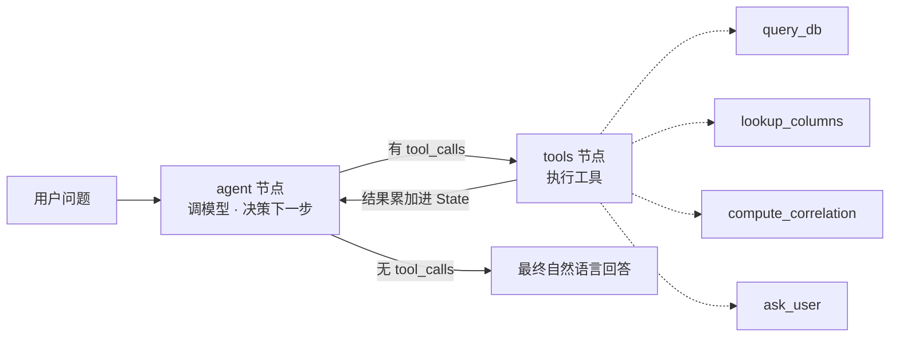

# 胎儿脑数据 ChatBI —— 分析型自然语言问数 Agent

> 面向科研数据的 ChatBI：让不懂数据库的研究者用自然语言查询与分析多中心胎儿脑 MRI 的形态学指标，支持多步分析、自我纠错、歧义澄清。
>
> 技术栈：Python · SQLite · LangGraph · DeepSeek(OpenAI 兼容) · MCP 思路 · Streamlit

---

## 1. 这个项目解决什么

实验室积累了多中心胎儿脑 MRI 数据，处理后得到 **1761 个个体 × 154 个形态学特征**（各脑区体积、皮层表面积/厚度、曲率、脑沟深度、半球不对称，以及组织级 19 + 精细脑区级 124 的分形维数 FD）。这些数据散在多张格式不一的表里，做统计/筛队列只能手工翻表，慢、易错，且在上百列里容易选错列。

本项目把这一过程做成自然语言入口：一句话即可完成筛选、聚合、跨中心对比、相关性分析等——工业界称之为 **ChatBI / 智能问数**。

## 2. 数据与库表设计

由原始 Excel/CSV 清洗后导入 SQLite（`build_db.py`），三张核心表：

| 表 | 作用 | 说明 |
|---|---|---|
| `subjects` | 个体维度（过滤用） | 中心、孕龄、模态、`age_known`；由脏 `source` 归一而来 |
| `brain_features` | 形态学度量（聚合用） | 154 个指标，`subject_id` 与 subjects 关联 |
| `semantic_dict` | 语义层 | 字段 → 中文术语 → 单位 → 口径，喂给 LLM 做语义对齐 |

**关键数据决策**：
- **孕龄缺失**：约 564/1761 个体原始无孕龄记录。用 `age_known` 标注、**不填补不删行**；涉及孕龄的查询主动说明排除。
- **隐私**：医院原始表含 PII（姓名/身份证/电话等），一律不入库、不公开；仅规划抽取脱敏后的“检查号/诊断/描述”。
- **语义层**：154 列（大量偏门中文 FD 列名）无法全塞进提示词，用语义字典 + 按需检索，这是工业界处理大 schema 的 **schema-linking** 思路的轻量实现。

## 3. 架构：从 Workflow 基线到 Agent

项目分两层，刻意保留基线作为对照：

- **基线（Workflow）** `nl2sql.py`：单次 LLM 调用，自然语言 → 生成 SQL → 执行 → 返回。流程写死，不循环、不纠错、不澄清。
- **Agent（ReAct）** `agent.py`（手写循环）/ `agent_graph.py`（LangGraph 版）：模型在开放循环里**自主决定**调哪个工具、是否重试、何时停止。



**为什么用 Agent 而非纯 Workflow**：查询/过滤这类可控路径本可用 workflow；但研究者的开放式分析（步数和路径取决于中间结果、甚至该做哪几步都不确定）无法提前画出流程图，必须由模型运行时决定 —— 这才是 agent 的正当理由。真实设计是混合：可控处 workflow，开放分析处 agent。

## 4. 四个工具（能力 = 加工具，不改控制流）

| 工具 | 作用 | 对应解决的失败模式 |
|---|---|---|
| `query_db(sql)` | 执行 SELECT；**出错返回错误文本**给模型 | SQL 报错 → 自我纠错 |
| `lookup_columns(keyword)` | 二元词模糊匹配查准确列名 | 154 列易选错/瞎编列名 |
| `compute_correlation(sql,x,y)` | pandas 算皮尔逊相关 | 相关性/趋势 SQL 算不了 |
| `ask_user(question)` | human-as-tool，歧义时反问 | 问题有歧义时不该瞎猜 |

安全：`db.py` 两层防护 —— 正则拦截非 SELECT + 只读连接（`mode=ro&immutable=1`），纵深防御。

## 5. 评估（方法论 + 可复现）

`build_eval.py` 生成带**标准答案(gold)**的评估集 `eval_cases.json`；`eval.py` 对同一套题跑 baseline 与 agent，**按题型分类判分**：

- 数值/分组题：比对数字（带容差）
- 相关性题：需用对工具且 r 接近 gold
- 歧义题：正确行为是**调用 ask_user 澄清**（无唯一 gold）
- 缺失数据题：数值对 **且** 答案说明了排除

**评测维度**（参考 Spider / BIRD 等文本转 SQL 基准，共 36 题）：不只测"答对数字"，还覆盖——执行准确率、**同义词鲁棒性**（用户词≠字段词，如"孕周"vs"孕龄"）、**隐式列/模式链接**（不点名列，如"大脑最大"）、**领域知识**（如"脑室扩张"→侧脑室体积）、**SQL 复杂度**（区间/多条件/分组内求最值）、**脏数据/空值**、**不可答/防幻觉**（问库里没有的字段应答"没有"而非瞎编）。

**结果**（36 题，`python eval.py` 实测，DeepSeek-v4-flash）：

| 类别 | 题数 | Baseline | Agent |
|---|---|---|---|
| 纯查询/SQL（简单→复杂） | 23 | **23** | 19 |
| 相关性统计 | 4 | 0 | **4** |
| 歧义澄清 | 3 | 0 | **3** |
| 不可答/防幻觉 | 3 | 0 | **3** |
| 缺失/脏数据/透明 | 3 | 1 | **3** |
| **总准确率** | 36 | **67%** | **89%** |

**关键洞察（反直觉）**：agent 并非处处更优——在纯 SQL 查询上 baseline 反而更稳（23/23 vs 19/23），agent 的优势**全部**来自 baseline 结构上无法完成的四类能力（相关性/澄清/防幻觉/透明）。即 agent 是"用一点纯查询稳定性，换来一整类新能力"的权衡。

agent 失分题分析：澄清过度（`syn1`，few-shot 副作用）、分组内求最值这类公认难 SQL（`h5`）、复杂过滤+分组（`h2`）、以及 `v8` 在 temp=0 下跨轮结果不稳——提示应多次运行看方差。

> 复现：`python eval.py`。判分为启发式（数值容差 + 关键词），更严谨可加 LLM-as-judge / 多次运行取均值方差。诚实说明：部分类别（澄清/防幻觉）是 agent 独有能力，baseline 结构上无法完成，故应看**分类别对比**而非仅总分。

> 复现：`python eval.py`。判分为启发式（数值容差 + 关键词），更严谨可加 LLM-as-judge。诚实说明：部分题型（如澄清）是 agent 独有能力，baseline 结构上无法完成，故应看**分题型对比**而非仅总分。

## 6. 运行

```bash
pip install -r requirements.txt
cp .env.example .env           # 然后在 .env 填入你的 DEEPSEEK_API_KEY
python make_synthetic_data.py  # 生成合成数据 data.db（脱敏假数据，可公开运行）
python build_eval.py           # 基于合成数据生成评测集
python check_deepseek.py       # 连通性自测
python cli.py                  # 基线，命令行
python agent_graph.py          # LangGraph agent，命令行
streamlit run app.py           # 演示界面
python eval.py                 # 评估 baseline vs agent
```

> **数据说明**：原始胎儿脑数据含隐私（`subject_id` 嵌有姓名拼音），**不随仓库发布**。仓库提供 `make_synthetic_data.py` 生成**同结构的脱敏合成数据**，任何人可据此运行 Demo 与评测。README 中 67% / 89% 等结果是在**真实科研数据**上得到的，合成数据仅用于跑通流程。

> 注意：`data.db`、`.env`、`chat_memory.sqlite`、原始数据均已在 `.gitignore` 中排除，不入库、不公开。

**课题组内网多人使用：**

```bash
streamlit run app.py --server.address 0.0.0.0 --server.port 8501
# 同一内网的同事用 http://<这台机器的内网IP>:8501 访问
```

- **访问口令**：进门需口令（`.env` 里的 `LAB_PASSWORD`，请改掉默认值）。
- **持久化记忆**：多轮对话记忆用 `SqliteSaver` 落盘（`chat_memory.sqlite`），重启不丢。
- **会话隔离**：每个浏览器会话独立 `thread_id`，多人互不串。
- **数据安全**：医疗衍生数据，仅部署在内网、勿挂公网。

> 定位是**课题组内部工具**（小规模、低并发）。面向高并发生产则需换 FastAPI 后端 + PostgresSaver + 鉴权/配额/可观测性，超出本项目范围，刻意未过度工程。

## 7. 局限与后续

- **评估规模**：当前 36 题覆盖多维度；进一步可扩到 100+ 题，并**纳入真实使用中的提问**（比自造题更可信）。
- **统计工具**：目前仅相关性，可扩展描述统计、分组检验等。
- **澄清**：`ask_user` 面向命令行交互；Web 端为单轮演示，多轮澄清待完善。
- **`lookup_columns`**：二元词匹配偏召回，精确率有损，可加排序/rerank。
- **判分**：启发式判分可升级为 LLM-as-judge。
- **规模**：SQLite 适配当前规模；若多人并发/数据量上升，可平滑迁移 Postgres/DuckDB。

## 8. 项目结构

```
chatbi/
├─ build_db.py        # 清洗 Excel/CSV → SQLite
├─ config.py          # 配置隔离（模型/base_url/key/路径）
├─ db.py              # 只读连接 + schema 自省 + 两层安全执行
├─ context.py         # 语义字典 → 给 LLM 的“数据库说明书”
├─ nl2sql.py          # 基线：单次 NL2SQL（workflow 对照组）
├─ tools.py           # 四个工具 + JSON schema
├─ agent.py           # 手写 ReAct 循环（讲清机制）
├─ agent_graph.py     # LangGraph 状态图版（显式节点/边）
├─ build_eval.py      # 生成带 gold 的评估集
├─ eval.py            # 分题型判分 + baseline vs agent 记分卡
├─ app.py             # Streamlit 演示界面
├─ cli.py / run_batch.py  # 命令行 / 批量测试
└─ requirements.txt
```
