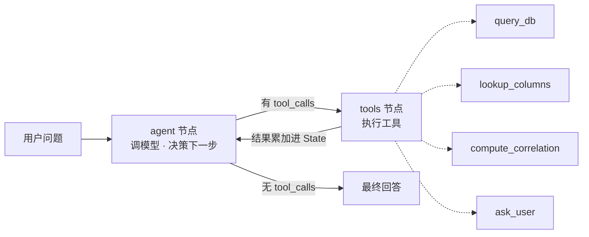

# ChatBI · 面向科研数据的分析型问数 Agent

> 用自然语言查询与分析结构化科研数据 —— 一句话完成筛选、聚合、跨中心对比与相关性分析。


基于 LangGraph 的 ReAct Agent，面向多中心胎儿脑 MRI 的形态学指标（1761 例 × 154 指标）。相比单次 NL2SQL，在自建 36 题离线评测上任务通过率 **67% → 89%**——增量优势集中在基线做不到的能力（自我纠错、歧义澄清、统计、防幻觉）。

> 数据含隐私（`subject_id` 嵌姓名拼音），不随仓库发布。仓库提供 `make_synthetic_data.py` 生成同结构的合成数据供运行；README 中的评测数字为真实数据上的结果。

## 特性

- **ReAct Agent（LangGraph）**：模型自主编排工具、SQL 出错自我纠正、歧义主动澄清、多轮记忆
- **4 个工具**：库查询、字段语义检索（schema-linking）、pandas 统计、向用户澄清（human-in-the-loop）
- **schema-linking**：154 列宽表按需检索字段，缓解选错列 / 幻觉列名
- **安全**：只读连接 + 语句白名单双层防护，拦截破坏性 SQL
- **评测**：参考 Spider / BIRD 维度的 36 题分类型评测，baseline vs agent 对比 + 失败归因
- **界面**：Streamlit，流式展示工具调用过程 + 多轮对话

## 架构



## 快速开始

```bash
pip install -r requirements.txt
cp .env.example .env            # 填入 DEEPSEEK_API_KEY
python make_synthetic_data.py   # 生成合成数据 data.db（脱敏，可公开运行）
python build_eval.py            # 生成评测集

streamlit run app.py            # Web 界面（推荐）
python agent_graph.py           # 命令行 agent
python eval.py                  # baseline vs agent 评测
```

## 评测结果

36 题离线评测（DeepSeek-V4-Flash，固定配置单次实验）：

| 类别 | 题数 | Baseline | Agent |
|---|---:|---:|---:|
| 纯查询 / SQL | 23 | 23 | 19 |
| 相关性统计 | 4 | 0 | **4** |
| 歧义澄清 | 3 | 0 | **3** |
| 不可答 / 防幻觉 | 3 | 0 | **3** |
| 缺失 / 脏数据 | 3 | 1 | **3** |
| **合计** | 36 | **67%** | **89%** |

Agent 并非处处更优——纯 SQL 上 baseline 反而更稳；优势全部来自 baseline 结构上无法完成的四类能力。判分为启发式（数值容差 + 关键词 + 行为判据），更严谨可加 LLM-as-judge。

## 目录结构

```
chatbi/
├── 核心         config.py  db.py  context.py  tools.py
├── 基线/Agent   nl2sql.py  agent.py  agent_graph.py
├── 数据/评测    build_db.py  make_synthetic_data.py  build_eval.py  eval.py  questions.txt
├── 入口         app.py  cli.py  run_batch.py  check_deepseek.py
└── README.md  requirements.txt  .env.example
```

## 设计要点

- **为什么用 Agent 而非纯 workflow**：查询/过滤这类可控路径 workflow 即可；但开放式分析（步数与路径依赖中间结果）无法预先画出流程图，需模型运行时自主决策。项目保留单次 NL2SQL 作对照，用评测量化收益。
- **能力靠加工具扩展，不改控制流**：新增能力＝加一个工具，Agent 循环不变。
- **易错、要精确的操作卸载给确定性工具**：如相关性交给 pandas，而非让模型手写复杂 SQL。

## 局限

- 评测为 36 题、单次运行、题目自出，存在过拟合风险；后续拟纳入真实用户提问、扩题量、多次运行报方差。
- schema-linking 目前为关键词（二元词）匹配，未用向量检索。
- 课题组内部工具规模（SQLite / 单机），非生产级高并发。

## 技术栈

Python · LangGraph · LangChain · DeepSeek (Function Calling) · SQLite · pandas · Streamlit
